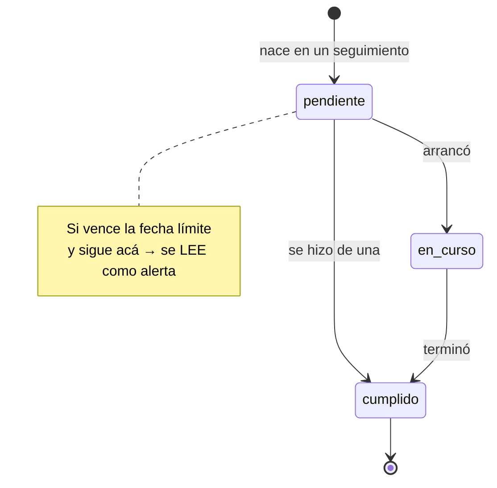

# Ciclo de vida de un compromiso

**Regla de gestión confirmada por JP el 01/09/2026.** No es una inferencia de
los datos ni una decisión de diseño: es cómo funciona el circuito real de
Coordinación. Lo que sigue es la especificación completa, para que el portal y
la base de datos la implementen igual.

---

## 1. Qué es un compromiso

Una acción que alguien se comprometió a hacer, con un responsable y un plazo.
Es distinto de un proyecto —que tiene avance y se mide— y de una observación de
monitoreo —que solo informa.

Un compromiso puede colgar de un proyecto, de un puntual, **o de ninguno de los
dos**. "Hablar con Sistemas porque un CAPS no tiene internet" no pertenece a
ningún proyecto. Lo único que un compromiso tiene siempre es **el área**.

---

## 2. De dónde nace

**De un seguimiento.** Su fecha de creación es la fecha de ese seguimiento, no
la del día en que alguien lo carga en el sistema.

También puede nacer de una reunión de mesa o de un monitoreo. En los tres casos
queda registrado de dónde salió, porque después hay que poder volver a la
reunión donde se asumió.

---

## 3. Los estados

### Los tres que se guardan

| Estado | Qué significa |
|---|---|
| `pendiente` | Se asumió, todavía no arrancó. **Es el estado inicial, siempre.** |
| `en_curso` | Arrancó pero no terminó |
| `cumplido` | Se hizo |

### El cuarto, que NO se guarda

| Estado | Cómo se obtiene |
|---|---|
| `alerta` | Se **deduce**: venció la fecha límite y el compromiso sigue abierto |

**Esta distinción es el corazón de la especificación.** Un compromiso no "pasa a
alerta": *está* en alerta porque venció y nadie lo cerró. Nadie carga ese
estado, y ningún proceso lo marca al cambiar el día.

Si `alerta` se guardara como los otros tres, haría falta un proceso que todas
las noches recorriera la tabla y actualizara los vencidos. Ese proceso no
existe, así que el dato quedaría desactualizado: un compromiso que vence hoy
seguiría figurando como pendiente hasta que alguien lo tocara. Derivarlo al
leer es correcto por construcción.

---

## 4. Las transiciones



- `pendiente → en_curso → cumplido` es el camino largo.
- `pendiente → cumplido` es válido y frecuente: se puede saltar `en_curso`.
- **`cumplido` es terminal.** Un compromiso cumplido no vuelve atrás; si
  reaparece el tema, es un compromiso nuevo de otro seguimiento.
- **`alerta` no aparece en el diagrama a propósito**: no es un nodo por el que
  se pasa, es cómo se lee un compromiso vencido que sigue en `pendiente` o
  `en_curso`.

### La regla, en una línea

```
si estado == cumplido        → cumplido
si fecha_limite < hoy        → alerta
si no                        → el estado guardado
```

`cumplido` gana siempre: un compromiso que se cumplió tarde está cumplido, no en
alerta.

---

## 5. La fecha límite

**Es obligatoria.** Todo compromiso nace con una.

Puede ser:

1. **La fecha del próximo seguimiento** — los seguimientos son cada seis
   semanas, así que es la fecha del seguimiento de origen + 42 días. Es el
   valor por defecto, y tiene sentido: si nadie define otra cosa, el compromiso
   se revisa la próxima vez que se juntan.
2. **Una fecha elegida** por quien lo carga, cuando el compromiso tiene un plazo
   propio.

### Por qué es obligatoria

Porque sin ella el mecanismo entero no funciona. `alerta` se deduce comparando
contra la fecha límite: si no hay fecha, **no hay comparación posible y el
compromiso queda en `pendiente` para siempre**, por más meses que lleve abierto.

Eso no es hipotético. Es exactamente lo que pasó en las planillas: hay 18
compromisos arrastrados de reunión en reunión sin que nada los marcara. El caso
extremo es "Portón" (Ambiente): **25 cargas entre febrero y agosto de 2026,
siempre en `Pendiente`, con el mismo comentario copiado semana a semana**. El
sistema no tenía cómo darse cuenta.

---

## 6. Cómo está implementado

### En el portal

`estadoCompromiso()` en `src/datos/selectores.js`:

```js
export function estadoCompromiso(c, hoy) {
  if (c.estado === 'cumplido') return 'cumplido';
  const dias = diasHasta(c.fecha_limite, hoy);
  if (dias !== null && dias < 0) return 'alerta';
  return c.estado;
}
```

El selector `compromisos()` agrega a cada fila `estado_efectivo` —el resultado
de esa función— y `dias_atraso`. **Todo lo que muestra o filtra por estado usa
`estado_efectivo`, nunca el guardado.**

El catálogo `ESTADOS_COMPROMISO` tiene los tres valores que se persisten. La
fecha límite por defecto sale de `UMBRALES.DIAS_ENTRE_SEGUIMIENTOS` (42), y el
formulario de seguimiento la precarga tanto en el alta a mano como en lo que
sale de transferir la minuta. No se puede guardar sin ella.

### En la base

```sql
create type public.estado_compromiso as enum ('pendiente', 'en_curso', 'cumplido');
```

Tres valores, sin `alerta`, consistente con lo de arriba.

**Pendiente de definir en el DER unificado:** hoy `fecha_limite` es nullable en
el esquema. Si la regla es que siempre hay una, corresponde `not null` — con la
salvedad del punto siguiente.

---

## 7. Los 124 compromisos históricos

Los que se cargan de las planillas **no tienen fecha límite**: el `_db` nunca la
registró. Decisión de JP: **entran sin fecha y por lo tanto sin alerta**, en vez
de inventarles una.

Consecuencia a tener presente: esos 124 nunca van a aparecer en alerta. Van a
estar visibles y consultables, pero mudos. Los que se carguen desde el portal de
acá en adelante sí van a entrar al circuito completo.

Esto es lo que impide poner `not null` en `fecha_limite` sin más: o se acepta el
null para el histórico, o se separan las dos cosas de alguna forma.

---

## 8. Vocabulario

Se dice **`alerta`**, no `vencido`. Es como le dicen las áreas y como figura en
los `_db`, y es lo que se lee en pantalla.

`vencido` sigue existiendo en el código, pero para **otra cosa**: es el nivel de
semáforo visual (el rojo) y el vencimiento de eventos, mesas y planificación. De
los 254 usos de la palabra en el repo, solo 21 eran del estado del compromiso y
son los que se renombraron el 01/09/2026.

Y se escribe **`en_curso`** con guión bajo, no `en curso`. Es como lo tiene el
enum de Supabase; el prototipo usaba el espacio y se normalizó el mismo día,
antes de que rompiera en silencio al conectar.

---

## 9. Lo que queda por resolver

1. **`fecha_limite` como `not null`** en el esquema, y qué hacer con los 124
   históricos que no la tienen.
2. **El vínculo con el proyecto o puntual.** Los 124 entran con `proyecto_id` y
   `puntual_id` en NULL. El vínculo histórico no está en el dato y
   reconstruirlo quedó en standby.
3. **`derivacion`** (Dirección / Secretaría) no existe en `compromisos`; en el
   esquema está en `actualizaciones`. 108 de los 124 la tienen cargada en el
   `_db`, y es lo que rutea cada cosa a un informe u otro. Si los informes de
   los lunes filtran por eso, hay que agregarla.
4. **Los 18 arrastres.** Van a entrar como vigentes porque nadie los cerró.
   Conviene revisarlos en la reunión de secretaría antes de que aparezcan en
   pantalla — es una buena primera demostración de para qué sirve el portal.

---

## Referencias

- `contexto/glosario.md` (repo de trabajo de JP) — el ciclo de vida en el
  glosario institucional, con el circuito de monitoreo y seguimiento.
- `src/datos/selectores.js` → `estadoCompromiso()`
- `src/datos/catalogos.js` → `ESTADOS_COMPROMISO`, `UMBRALES.DIAS_ENTRE_SEGUIMIENTOS`
- `src/modulos/seguimiento/CargarSeguimiento.jsx` → el alta y la validación
- `pruebas/selectores.test.mjs` → los casos que fijan la regla
- `supabase/datos/carga-inicial/00-README.md` → el mapeo de los 124 históricos
